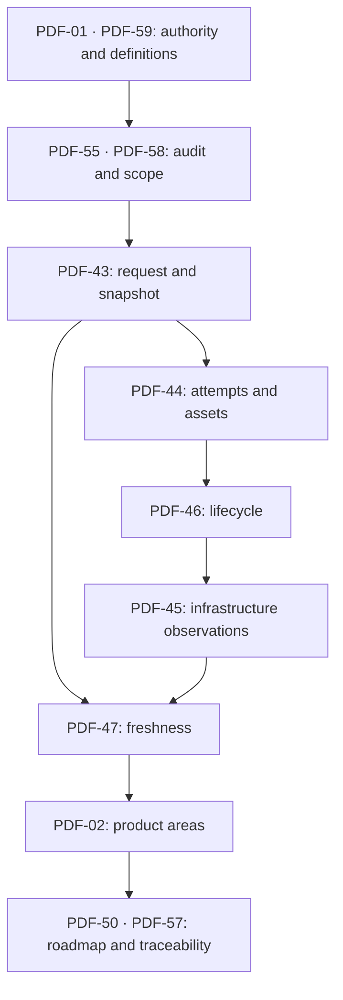

# Axis 01: architecture, data contracts and preparation

Baseline: `main`, `3cb5fde9cf43ee4093bcfb707fdd0b21ff06dbb5`.
Specification: `comfyui-ui-ux-specification-fa(1).pdf`, version 1.0,
3 October 2026, sections **01, 02, 43, 44, 45, 46, 47, 50, 55, 57, 58, 59**.
This document is the single architecture/backlog reference for this axis.

## Authority and scope (PDF-01)

The PDF is a product proposal, not a code audit. Suggested field names are
adapted to the actual API; existing correct behavior is preserved. User reports,
code-confirmed facts and proposed product behavior are distinguished below.
P0 means request/status correctness, P1 core experience/cost controls, P2 polish;
these priorities are not delivery estimates. Unknown telemetry remains unknown.
No repository write, GPU allocation, provider control operation or private .env
change is part of this delivery.

## Requirement extraction and dependency order

| ID / PDF page | Need and proposed solution | Acceptance / verification | Dependencies |
|---|---|---|---|
| PDF-01 / 5 | Verify the code before treating proposals as missing features; record authority, evidence and priorities. | Baseline SHA, evidence matrix and explicit unknowns; no invented capability. | None |
| PDF-59 / 63 | Agree on Job, Attempt, Worker, Instance, Session, Snapshot, Asset, Progress, Ready and Finalizing. | Identical meanings in contracts, tickets and API documentation. | PDF-01 |
| PDF-55 / 59 | Inspect submit/state/debounce/token/upload/polling/output; record actual A/B payloads; inspect attempt/lease/progress/readiness and provider/model limitations. | Present/partial/absent/unknown matrix with paths and test evidence. | PDF-01, PDF-59 |
| PDF-58 / 62 | Record auth/retry/cancel/cost/balance/retention/catalog/video/preset decisions; prevent unsupported V1 promises. | Explicit risk register, unknown financial/model telemetry and deferred feature list. | PDF-55 |
| PDF-43 / 47 | Align latest form, saved request and worker; version workflow/contract, validate fields, stable references, effective seed/LoRA/output data; durable snapshot and idempotency/recovery. | A/B request and worker match; first snapshot immutable; same key has consistent result; conflicts/invalid versions have stable errors; no token in snapshot. | PDF-55, PDF-58 |
| PDF-44 / 48 | Separate Job/Attempt/Output, retain retry history, fence expired callbacks; persistent file IDs with fresh links and known metadata. | Duplicate callback creates no duplicate asset; old lease cannot overwrite; success follows file validation; partial files remain visible; additive migration retains history. | PDF-43 |
| PDF-46 / 50 | Define allowed lifecycle transitions, finalization and cancellation limits; keep connectivity separate. | Backend rejects invalid transitions; terminal state does not regress; retry creates an attempt; timeline records reason; network loss alone does not set failed. | PDF-44 |
| PDF-45 / 49 | Separate group/provider, instance, worker/service/model, session and financial provenance. | Sanitized response; consistent replica/readiness; pull value/unit/source/time; missing money is null; observation intervals have explicit origin. | PDF-44, PDF-46 |
| PDF-47 / 51 | Per-entity versions/timestamps; reject older responses, guard overlapping polls and changed selection; authoritative reconnect snapshot. | Out-of-order poll and fast workflow switch do not overwrite newer records; browser and worker connectivity distinct; fresh/stale timestamps visible. | PDF-43, PDF-44, PDF-45, PDF-46 |
| PDF-02 / 6 | Three related areas: creation/editing, jobs/outputs, infrastructure/cost; independent draft/job data and persistent draft through detail/navigation. | Areas and source ownership documented; no horizontal overflow at 360px; switching views keeps form; unknowns understandable. | PDF-43, PDF-45, PDF-47 |
| PDF-50 / 54 | Deliver correct request first, lifecycle/telemetry second, input/gallery/tools third, video/comparison/personalization later. | Roadmap identifies delivered foundations and downstream dependencies; no unrelated implementation. | PDF-02, PDF-43..47 |
| PDF-57 / 61 | Behavior-sized tickets with evidence, reproduction, current/expected result, scope, dependencies, design, acceptance and tests; P0 before polish. | All 12 IDs have traceability, final status and test evidence. | All above |

## Audit before changes (PDF-55)

| Concern | Baseline evidence | Before |
|---|---|---|
| Execution mode | `backend/app/main.py:submit_job`, `direct_queue.py:enabled`, `docker-compose.yml` | Present: direct is opt-in; legacy queue still supported. Scheduler allocation is separately opt-in. |
| Form | `frontend/src/App.jsx:run/updateVariable` | Controlled React state, no debounce. A/B stale-request report is a user report until browser reproduction. No independent submit key or workflow response fence. |
| Token | `App.jsx:sessionToken`, `main.py:check_*` | Present: memory-only browser token; worker token separate. No change to auth policy in this axis. |
| Inputs | `main.py:upload/submit_job`, `storage.py:sign_s3_values` | Present: stable S3 input URIs; sign again at direct dispatch. No asset records. |
| Snapshot | `db.py:create_job`, `request_json/variables_json` | Partial: persisted rendered request, no versioned effective snapshot. |
| Attempt/lease | `direct_queue.py:claim/_fenced` | Partial: exclusive SQLite lease and bounded retries, no independent attempt history. |
| Retry | `main.py:retry_job` | Creates a new Job; direct in-place helper exists but is not used by public Retry. |
| Finalization/outputs | `direct_queue.py:finish`, `storage.py:job_images` | Partial: success accepts arbitrary JSON without object verification; output listing has no persistent asset/attempt identity. |
| Status/freshness | direct SQL updates and `App.jsx:refreshJobs/refreshInstances/loadWorkflow` | No transition graph/version fence; polls may overlap. Old provider callbacks can regress active legacy status. |
| Worker telemetry | `salad-worker/pull_worker.py` | Hello every idle 30s and job heartbeat every 15s. Synchronous Comfy gateway. No real compute progress, selected-model readiness or cancellation acknowledgement. |
| Provider | `salad_control.py:status` | Sanitized group/instance response, but raw pull value is displayed as percent. No verified unit, pricing/balance/billing route. |
| Capabilities | workflow API graph and `template.py` | Generic placeholders and fixed graph inputs; no provider-confirmed catalog/schema of negative prompt, LoRA, video or allowed dimension steps. |
| Settings | `settings_store.py`, `config.py` | Active mutable group/image settings are seeded once from private .env into SQLite. Must preserve this existing behavior. |

## Product structure (PDF-02)

Creation/editing owns the current editable draft and selected workflow. Jobs and
outputs own immutable submitted snapshots and persistent execution records.
Infrastructure/cost owns observed provider and application telemetry, never form
state. Existing components stay mounted when switching the three areas, so the
draft survives. Workflow editing stays available; this axis does not add a new
model catalog, gallery/lightbox or video tool. Broader visual work is deferred.

## Ticket template (PDF-57)

ID: PDF-XX. Title: observable behavior. Priority: P0/P1/P2.
Evidence: user report / confirmed in code / product proposal.
Problem; reproduction; current result; expected result; scope and files;
backend/worker dependencies; proposed design; acceptance criteria; tests;
status and residual limitations. The extraction matrix above is the backlog;
the delivery report records final file/test/status evidence for every ticket.

## Definitions (PDF-59)

Job: one creation/editing request. Attempt: one execution of that Job.
Worker: workflow execution service. Instance: observed provider infrastructure
unit. Session: application-managed observed activity interval, not an invoice.
Snapshot: independent effective settings of a submitted job. Asset: stable
identity of an input/output file. Progress: scoped value with a known unit.
Ready: verified ability to process the selected tool, not image pull completion.
Heartbeat: freshness of Worker communication. Finalizing: computation has
returned and output validation/persistence is in progress.

The PDF's content source is the project conversation on 3 October 2026,
Vancouver time. The repository was not audited when that PDF was authored;
this delivery adds a pinned source audit and does not change the PDF.

## Implemented API contract (PDF-43/44/46)

`GET /api/workflows/{id}` adds `contract_version`, `workflow_version` (SHA-256
of the canonical API graph), `tool_id` and `variable_keys`. These bindings do
not assert a tested model catalog. The UI pins the loaded saved workflow.

`POST /api/jobs` retains `workflow_id`, `variables`, `priority`; adds version 1,
optional `client_request_id`, `workflow_version`, `source_job_id`. Version 1 is
the default for old callers. Invalid explicit versions and unbound/unsupported
fields produce stable `error.code`, `error.message`, `error.path`; validation
never echoes raw input. Existing `detail` remains for compatibility. Auth,
access, capacity and upstream errors have distinct codes. Legacy callers without
a request key remain supported but do not receive cross-request idempotency.

The proposed tool/model/prompt/parameters/references/output/seed/LoRA fields
are adapted into the effective snapshot from the actual variable bindings and
rendered graph. Independent selectors that the workflow cannot consume are
rejected, not silently saved or claimed as supported. Fixed loader filenames
are recorded; model/LoRA content versions and capability ranges remain null.
Seed values are preserved; this release does not silently randomize or resize.
References use the existing upload UUID (`asset_id` alias on upload) when the
stable input URI identifies it; role is generic `reference`, order is explicit.
An arbitrary external reference has no invented asset ID.

Same request key + same submitted values returns the original Job, even if its
workflow was later edited/deleted. A key with changed inputs returns 409;
hidden Jobs cannot be recreated through that key. The recovery endpoint is
`GET /api/job-requests/{client_request_id}` under the existing application auth.
The UI keeps an unacknowledged request in tab session storage, including only
its non-credential body. It recovers with that key and never creates a different
request while the original is unresolved. Ordinary drafts retain the existing
local storage behavior. Browser tokens remain memory-only.

Responses preserve `id/state/request/variables/output/attempts` and add
`job_id/status/snapshot/owner/source_job_id/queued_at/started_at/finished_at/
active_attempt_id/version/last_updated_at/attempt_history/assets/timeline/
communication/progress/output_summary`. Owner `controller` names the existing
shared application principal, not a new user/account identity. Historic owner
and unobservable times/snapshots remain null. Job start is the first observed
execution; each attempt has its own start/end. Job finish is cleared on explicit
retry, while previous attempt finish times remain. All new timestamps use UTC.

An Attempt has UUID, per-Job sequence, previous attempt ID, creation/start/end,
Worker or provider Job ID, private lease hash, state and failure reason. Optional
`attempt_id` is accepted in worker heartbeat/complete/fail; the lease token
always fences ownership, so old workers without the extra field still work.
New direct attempts use independent `outputs/{job}/{attempt}/` prefixes.
Worker heartbeat continues until result acknowledgement, including finalizing.

New Jobs in **both** modes require finalizing and verified R2 objects before
success. HEAD checks readable, non-empty media files; unavailable metadata is
null, never inferred from the requested size. Assets have UUID, stable key,
Job/attempt, media/MIME, observed size/metadata, status, creation and verification
time. Video metadata is nullable; this adds a contract, not a video editor.
URLs are renewed at read time; previews have no invented thumbnail asset.

Partial-success policy: one or more verified files permits `succeeded`, with
`output_summary.partial_success` if known files failed or a known requested
count was not met. Every verified file stays visible. No verified file produces
`failed` with an actionable storage summary. R2 transport/5xx outages keep
finalizing and return a retryable acknowledgement error, not false success.
Identical successful callbacks are acknowledged with no new asset or version;
different/expired callbacks are rejected. Historic unversioned Jobs retain the
old output format and are explicitly `legacy_unverified`, without invented
attempts or retrospective file verification.

Direct Retry reopens the same Job with a new attempt; newly versioned Salad
Queue Retry also reopens the same Job using its immutable saved graph and an
independent provider execution/prefix. For pre-axis legacy records lacking a
snapshot, the old linked-new-Job retry behavior is preserved. Ambiguous remote
submission/stalled retries require the existing explicit duplicate consent.
Edit & Run is Regenerate: a new Job with an optional source link.

Stored state aliases remain compatible: pending/waiting -> queued,
submitting -> accepted, processing -> running, submit_failed -> failed.
Preparing is Job preparation; it is never derived from provider deployment.
Backend transition guards and explicit retry generations reject regressions;
storage constraints prohibit unverified success. Timeline stores observed
transitions/reasons. `stalled` remains a legacy overdue communication indicator,
not proof of processing failure. Direct lease recovery retains its existing
bounded retry policy; expiry exhaustion is a controller timeout result, not
proof of a ComfyUI computation error. Active GPU cancellation is not available;
pending direct hide cancels dispatch, while active hide never claims cancellation.

## Observations and precedence (PDF-45/47)

Job version is SQLite authoritative; its read snapshot includes consistent
attempts/assets/events. Older provider responses cannot commit across the
expected-version fence. Frontend merges Job IDs/versions, prevents overlapping
polls and invalidates old lists after submit/retry/hide. Workflow/upload results
are fenced by selection generation. Another tab reloads the official API snapshot.

Infrastructure version is per-group **controller observation** order, not
invented provider event sequence. Late observations cannot overwrite a newer
stored group observation. Provider timestamps are separately preserved.
`provider_ready` is separate from application/model readiness; the latter
remain null because the current worker reports communication but not capability
or selected-model readiness. Worker connection uses recent hello/active lease
heartbeat; no allocated instance cannot leave a ghost Worker looking connected.
Pull progress carries value, null unit, image-pull scope, source and timestamp;
the UI does not append percent to an unverified provider unit.

Observed sessions persist first/last seen, disappear-observed stop and activity
intervals. They do not assert provider allocation/billing boundaries. First
selected-tool-ready time remains null until verified telemetry exists.
Financial rate/currency/source/time, estimated cost/source, account balance/time
and actual billing/source/time are all independent and null without a verified
source. No fake zero, hourly rate, Ready timer or monetary calculation is made.
The UI shows last observation, marks stale/error snapshots and distinguishes
browser disconnection from stale Worker communication. Observations become
stale after 30 seconds (three normal 10-second polls); this is an application
display policy, not a provider SLA or heartbeat timeout.

## Roadmap and decisions (PDF-50/58)

1. Delivered foundations: correct/pinned request, validation, idempotency,
   immutable snapshot and regression checks.
2. Delivered foundations: Job/attempt/asset contracts, observed times,
   finalizing/transition/version fences, layered infrastructure/session records.
   Later axes add actual progress, cancellation acknowledgement, rich timelines
   and Ready timers only when the worker reports enough evidence.
3. Later axes: upload preview/roles, supported dimensions, gallery/lightbox,
   output actions, model/Workflow catalog, advanced controls/LoRA and presets.
   These depend on verified schemas; financial UI depends on actual API/rates.
4. Later axes: chosen video tools/formats, graph summary, comparison, sharing,
   personalization/history performance. Responsiveness and secret handling
   apply throughout; timing estimates need real deployment/team capacity.

Open product decisions: multi-user auth/ownership and token policy, file/event
retention, active cancellation, cost model and authorized balance/billing API,
verified tool catalog, video formats and preset storage/sharing. This release
does not silently decide them. No provider policy, GPU hardware or scheduler
activation changes; mutable image/group settings keep their existing SQLite
source. Exactly-once GPU execution across network partitions is not guaranteed:
leases fence stored results, while the inherited bounded recovery may dispatch
another compute attempt if an unacknowledged worker disappears. Consent is
still required for ambiguous manual legacy retries.

## Final evidence and ticket status (PDF-55/57)

All 12 IDs have completed their **axis-one foundation** implementation or
documentation. Complete does not imply that later-axis product features or
unobservable provider/model facts have been implemented. Each acceptance row
above is backed by the delivery report and the tests below.

Controlled baseline browser reproduction recorded real submit bodies with
`prompt.user=A`, then `prompt.user=B`, seed 123456789 in both. The reported stale
Prompt could not be reproduced in this pinned baseline scenario. Production
Workflow/node behavior, deployed source and gateway caching were not tested.
The changes close evidenced contract/race/idempotency gaps without inventing
a root cause for that production report.

Validation: new Python suite covers request/lease/state/storage/migration/
provider/worker behavior; original suites remain passing; Node checks cover
merge/snapshot helpers and Chromium scenarios for A/B, immediate double-click,
lost response/reload, selection race, navigation, 360px and multiple tabs.
Build and archive extraction/byte equality are recorded in the delivery report.
